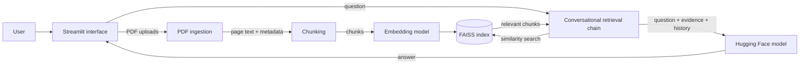

# IDQS — Intelligent Document Query System

A Streamlit application for asking grounded questions across a set of PDF documents. IDQS extracts text from uploaded files, indexes chunks with semantic embeddings, retrieves relevant evidence for each question, and generates a conversational response.

This portfolio project focuses on the engineering of a small Retrieval-Augmented Generation (RAG) workflow: ingestion, retrieval, session state, and failure handling.

## Architecture



### Request lifecycle

1. **Ingest:** `PdfReader` extracts text page by page. Unreadable uploads are reported without discarding the entire batch.
2. **Preserve provenance:** every usable page stores its source filename and page number.
3. **Chunk:** overlapping chunks improve retrieval recall while preserving usable context.
4. **Index:** sentence-transformer embeddings are stored in a session-scoped FAISS index.
5. **Retrieve and generate:** each question retrieves relevant chunks; the chain combines them with conversation history before generation.

## Design choices

| Decision | Why | Trade-off |
| --- | --- | --- |
| Page-level metadata | Supports provenance and future citations | More ingestion bookkeeping |
| In-memory FAISS | Simple, fast, no database setup | Index disappears after the session |
| Local embeddings | Documents do not leave the app for indexing | First run downloads the model |
| Hosted Hugging Face LLM | Keeps the app light enough for a laptop | Requires a token and network access |
| Conversation buffer | Enables follow-up questions | Long chats need a future summary/window policy |

## Repository layout

```text
.
├── README.md
└── Project - K/
    ├── app.py                 # Streamlit composition and user interaction
    ├── idqs/
    │   ├── config.py          # Environment-backed configuration
    │   ├── documents.py       # PDF extraction and chunk creation
    │   └── rag.py             # Vector index and retrieval-chain construction
    ├── htmlTemplates.py       # Presentation-only chat templates
    ├── requirements.txt
    └── .env.example
```

## Run locally

Requirements: Python 3.10+ and a Hugging Face token permitted to use the selected model.

```bash
git clone https://github.com/shiva-kumar-1319/Chat-with-Multiple-PDFs.git
cd Chat-with-Multiple-PDFs/"Project - K"
python -m venv .venv
```

```powershell
# Windows PowerShell
.\.venv\Scripts\Activate.ps1
```

```bash
# macOS / Linux
source .venv/bin/activate
pip install -r requirements.txt
```

Create `.env` from `.env.example`, set `HUGGINGFACEHUB_API_TOKEN`, then run:

```bash
streamlit run app.py
```

## Configuration

| Variable | Default | Purpose |
| --- | --- | --- |
| `HUGGINGFACEHUB_API_TOKEN` | none | Required token for hosted generation |
| `EMBEDDING_MODEL` | `sentence-transformers/all-mpnet-base-v2` | Sentence embedding model |
| `LLM_REPOSITORY` | `google/flan-t5-large` | Hugging Face generation model |
| `CHUNK_SIZE` | `1000` | Maximum characters per retrieval chunk |
| `CHUNK_OVERLAP` | `200` | Context shared by neighbouring chunks |
| `RETRIEVER_K` | `4` | Number of chunks retrieved per question |

Never commit `.env` or access tokens.

## Limitations and next steps

- Image-only PDFs need an OCR stage, which is not included.
- Source/page metadata is retained, but citations are not yet displayed in the interface.
- The index is session-scoped; there is no persistent document library or multi-user isolation.
- Retrieval quality depends on document quality, chunking settings, and the selected embedding model.

Suggested next improvements: display source citations, add OCR, create retrieval-quality fixtures, and introduce a persistent per-user document store.

## License

Educational and portfolio use.
